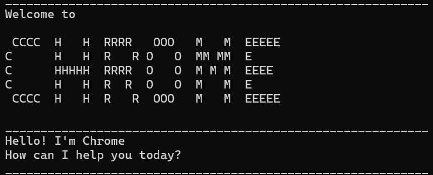

# Chrome User Guide



## Introduction
Chrome is a CMI List tracker for everyday use!
It can track Events, Deadlines and simple tasks with
no date

## Example feature
### Adding deadline
You can add deadlines using a command followed by a description and time.
These will be saved to your Task List

Example: `deadline CS2113 /Friday`

Your deadline will be added to the list alongside a marker
and how many tasks you have in the list
```
Expected output:
____________________________________________________________
Got it! I've added this task: [D][ ] CS2113 (by: Friday)

Now you have: 3 tasks in the list
____________________________________________________________
```

# Chrome Command List

## Task Management
- `todo <description>` - Adds a new to-do task.
- `deadline <description> /<date>` - Adds a task with a deadline.
- `event <description> /<start> /<end>` - Adds an event with a start and end time.
- `list` - Displays all tasks.
- `find <keyword>` - Searches for tasks containing the keyword.
- `delete <task number>` - Removes a task from the list.

## Task Status
- `mark <task number>` - Marks a task as done.
- `unmark <task number>` - Marks a task as not done.

## System Commands
- `bye` - Exits the program and saves tasks.

## Saving
- `save` - Saves task list to data directory
